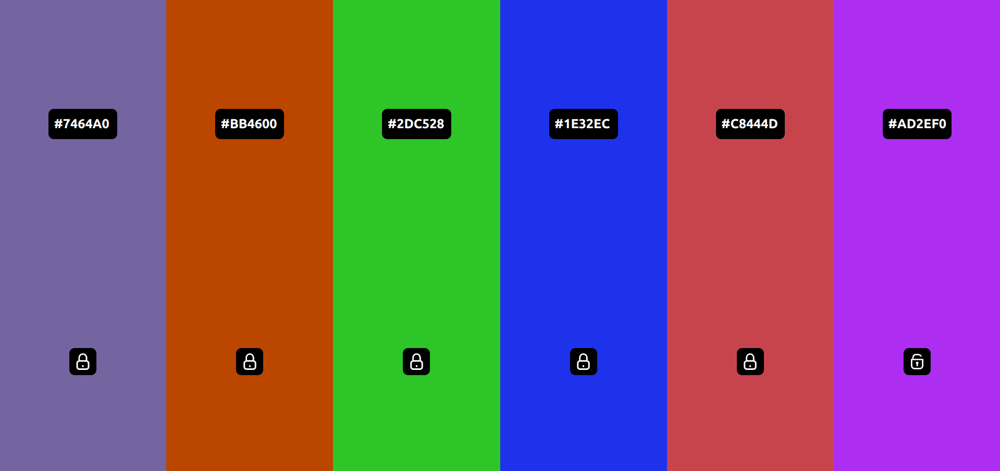

# Учебный проект Get color theme

## Описание проекта
Учебный проект для выбора набора цветов. По умолчанию доступно 6 колонок для выбора цвета. По нажатию клавиши Space на клавиатуре колонки заполняются рандомными цветами. В колонке отображается hash текущего цвета и кнопка для блокирования колонки. Если колонка заблокирована, для неё не будет меняться цвет при следующем нажатии клавиши Space на клавиатуре. При нажатии на кнопку с hash цвета происходит копирование hash в буфер обмена. Когда все колонки заблокированы, следующее нажатие клавиши Space добавит в адресную строку браузера список из набора 6 hash цветов. Ссылку можно скопировать чтобы поделиться. При загрузке такой ссылки будет открываться выбранный набор цветов

## Стек технологий
html, scss, js ES6. Сборка проекта Vite. Пакетный менеджер NPM